# Module 01: Troubleshoot business continuity with Microsoft Azure

**Estimated Time: 30 minutes**

You've been asked to make a backup of a virtual machine. Your development team have asked that you make the backup application consistent.

## Task 1: Create a backup

1.  If you are not logged in already, click on Azure portal shortcut that is available on the desktop and log in with below Azure credentials or skip to **step 3**.
    * Azure Username/Email: <inject key="AzureAdUserEmail"></inject> 
    * Azure Password: <inject key="AzureAdUserPassword"></inject>

1. Select **Resource groups** under **Navigate**.

    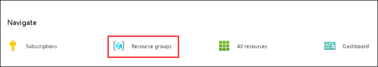
    
1. Under Resource groups, select **lab01-rg-<inject key="Deployment ID" enableCopy="false" />**.

    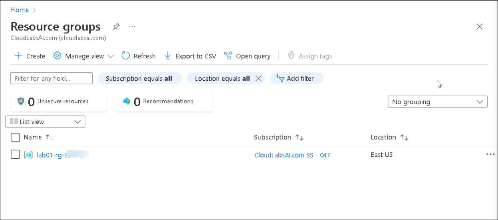

1. Now, search for **vm (1)** and select the virtual machine named **VM1-<inject key="Deployment ID" enableCopy="false" /> (2)**.

    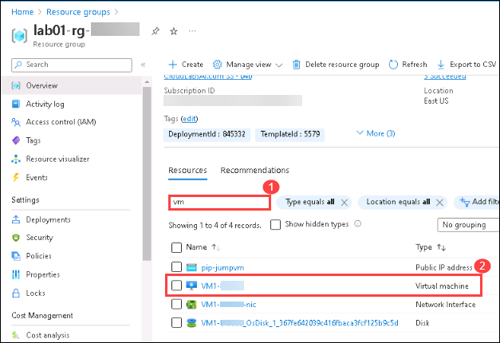

1. If the VM is **running (1)**, select **Stop (2)**.

    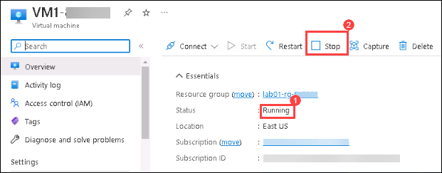
   
1.  select **Do you want to reserve the Public IP address**, then select **OK**.
   
    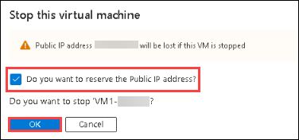

1. Wait for the **Status** to show **Stopped (deallocated)**.

    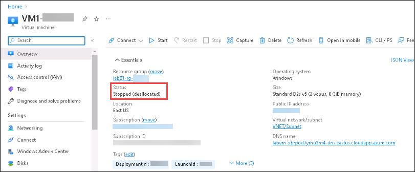

1. In the left navigation pane, under **Operations**, select **Backup**.

    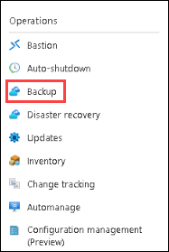

1. Enter the following settings:

   - Recovery Services vault: **Create new (1)**
   - Backup vault: **labdemo (2)**
   - Resource Group: select the **lab01-rg-<inject key="Deployment ID" enableCopy="false" /> (3)** from the dropdowm.
   - Policy sub type: **Standard (4)**
   - Choose backup policy: Use the **default policy (5)**

    Review the policy details at the bottom of the page, then select **Enable backup (6)** and wait for the deployment to complete.
    
    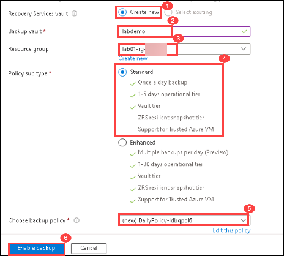

1. Select the portal menu on the top left, select **Virtual machines**, and then select **VM1-<inject key="Deployment ID" enableCopy="false" />** under  **lab01-rg-<inject key="Deployment ID" enableCopy="false" />** .

   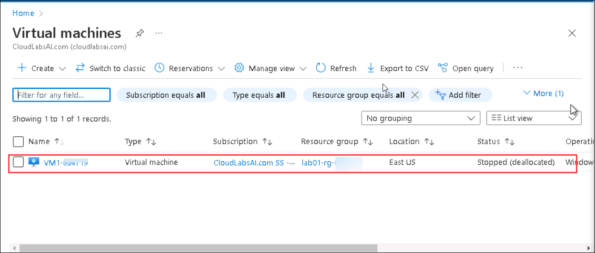

1. In the left navigation pane, under **Operations**, select **Backup**.

   

1. Select **Backup now**, and then select **OK**.

    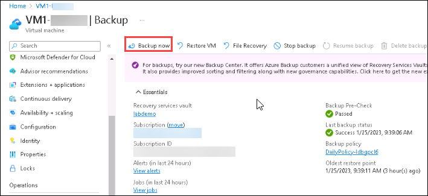

1. The backup starts, and runs in two phases.

    - In the first phase, it takes a snapshot of the VM. This takes about 10 minutes.

    - In the second phase, it moves the data into the recovery services vault. This takes about 50 minutes.

## Task 2: Monitor progress of the first phase

You won't see anything in the Backup page of the VM until the backup has completed. However, you can monitor it in the Backup center.

1. In the Azure portal, search for **backup center**, and then under **Services**, select **Backup center**.

   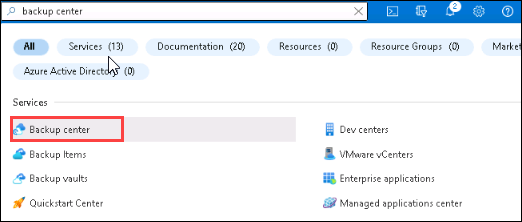

1. In the left navigation pane, under **Monitoring + reporting**, select **Backup jobs**. You should see your job running.

    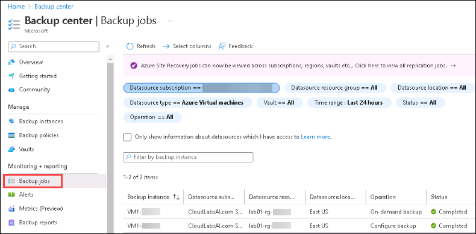

1. Select the backup job to see more info. You can see in the screen picture that the first phase has completed.

    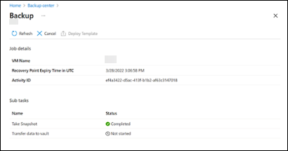
    
    >**Note**: Wait for 10-12min to get the output as shown in the screenshot above.

## Task 3: View results of first phase

When the first phase has completed, you can see that it is **Crash Consistent**.

1. In the breadcrumb trail, select **Backup center**.

1. In the left navigation pane, under **Manage**, select **Backup instances** and select  **VM1-<inject key="Deployment ID" enableCopy="false" /> (2)**.

    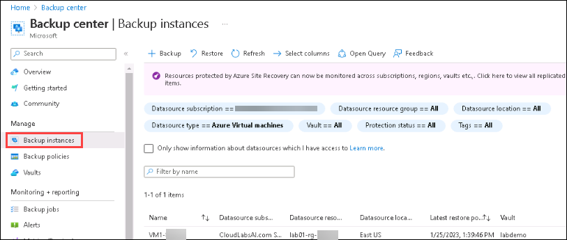

1. This shows that the backup is **Crash Consistent**. This is incorrect, the backup should be **Application Consistent**. You need to find out why and fix the            problem.

   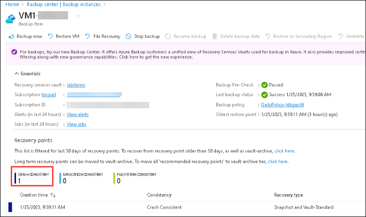

    >**Note**: Only the first phase has completed, and the data will now be transferring to the vault. You can continue with the lab; you don't have to wait for this to complete.

 
## Task 4: Create an application consistent backup

The reason the backup isn't application consistent is because the VM is in a **Stopped** state. You need to start the VM and wait for it to be in a running state before making your backups.

1.  Select the portal menu on the top left, select **Virtual machines**, and then select **VM1-<inject key="Deployment ID" enableCopy="false" />** under  **lab01-rg-      <inject key="Deployment ID" enableCopy="false" />** .

    

1. Select **Start**, and wait for the **Status** to show **Running**.

1. In the left navigation pane, under **Operations**, select **Backup**.

   

1. On the  **VM1-<inject key="Deployment ID" enableCopy="false" />** page, you should see that there is one **Crash Consistent** restore point.

    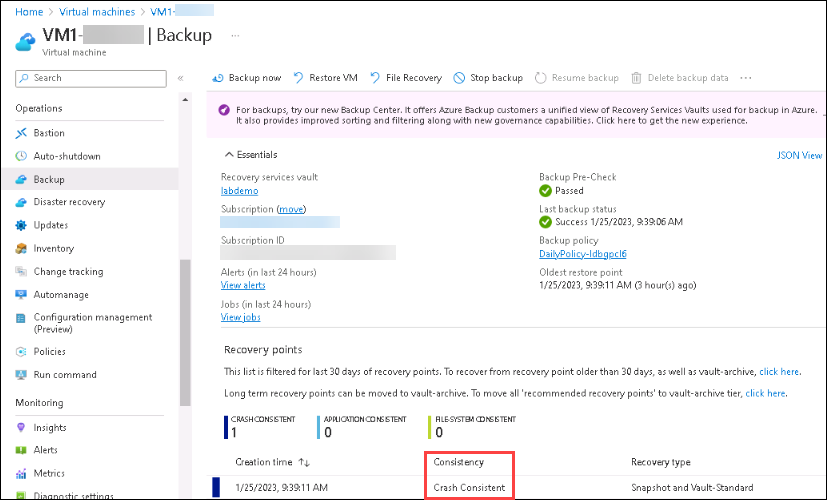

1. Select **Backup now**.

    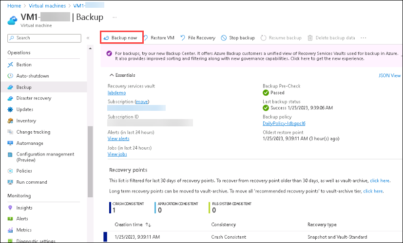

1. On the **Backup now** page, select **OK**. The second backup will be an incremental backup and should take less time than the first backup.

1. You can monitor progress in the **Backup center**.

1. In the Azure portal, search for **backup center**, and then under **Services**, select **Backup center**.

   

1. In the left navigation pane, under **Monitoring + reporting**, select **Backup jobs**. You should see your job running.

    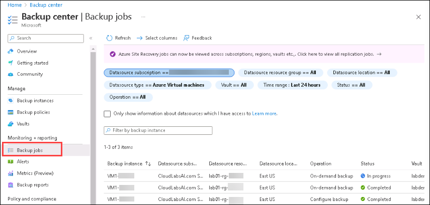

1. Select the backup job to see more info. You can see in the screen picture that the first phase is **In progress**.

    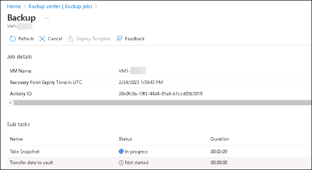

1. When the first phase is complete, navigate to the **Backup** page of the VM. 

1. You now have two backups, and the latest is **Application Consistent**.

    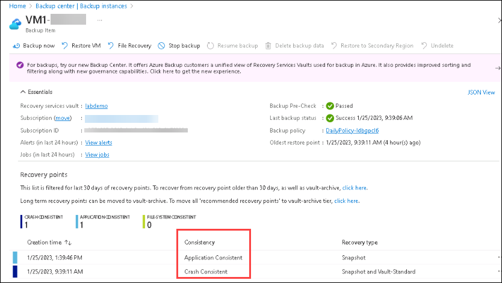

