# Troubleshoot cloud and hybrid connectivity in Microsoft Azure

**Estimated Time: 15 minutes**

You've configured your network as shown in the diagram below. You want VM1 and VM2 to communicate via the VnetHub. Users are complaining that VM1 cannot communicate with VM2. You need to investigate to diagnose the problem and then fix it.

There are three Azure virtual networks (VNets) in a hub and spoke topology.


## Task 1: Verify the network topology

1. If you are not logged in already, click on Azure portal shortcut that is available on the desktop and log in with below Azure credentials.
    * Azure Username/Email: <inject key="AzureAdUserEmail"></inject> 
    * Azure Password: <inject key="AzureAdUserPassword"></inject>

1. Select the portal menu on the top left, select **Resource groups**.

   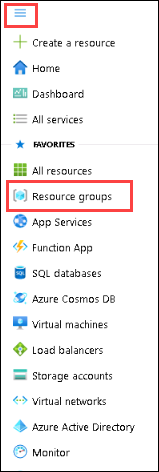

1. Select **lab03-rg-<inject key="Deployment ID" enableCopy="false" />**.

    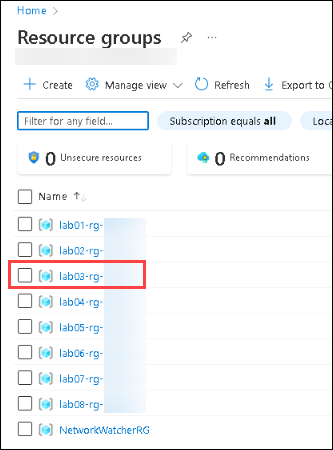

1. Select **Resource visualizer**.

   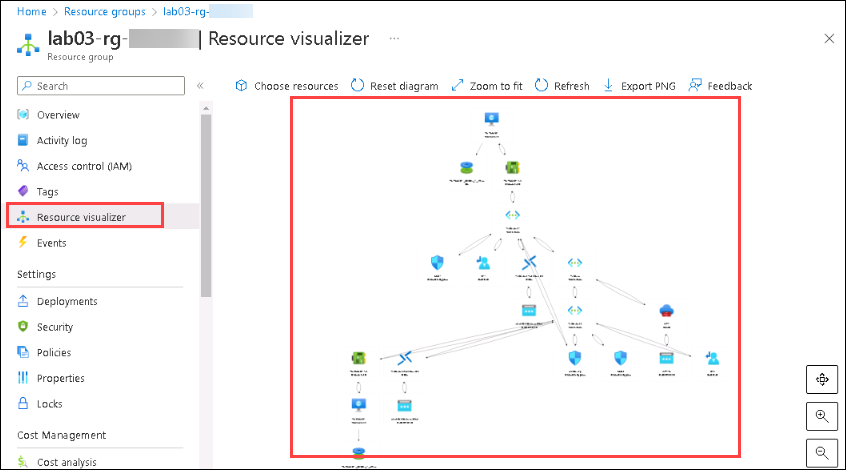

1. Check the private IP addresses of the firewall (**FW1**) and virtual machines (**VM1-<inject key="Deployment ID" enableCopy="false" />** and **VM2-<inject key="Deployment ID" enableCopy="false" />**). These are allocated automatically.

### Task 2: Check OSI level 3 connectivity

1. Connect to each virtual machine (****VM1-<inject key="Deployment ID" enableCopy="false" />**** and ****VM2-<inject key="Deployment ID" enableCopy="false" />****) using Bastion.

1. Select the portal menu on the top left, select **Virtual machines**.

1. Search for **vm1 (1)** under virtual machines blade and select **VM1-<inject key="Deployment ID" enableCopy="false" /> (2)** under lab03-rg-<inject key="Deployment ID" enableCopy="false" />.

    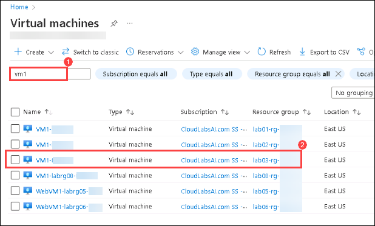

1. On the **Overview** pane, select **Connect**, then select **Bastion**.

1. Under **Connection Settings**, enter the following details and click on **Connect (3)**, a new tab in your browser should connect to **VM1-<inject key="Deployment ID" enableCopy="false" />**
 
     Username: `AdminXyz` (1).
     
     Password: `Azur$Pa55w0rd` (2).

    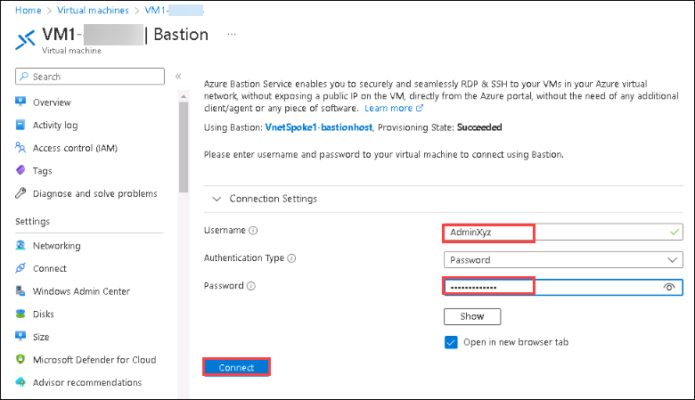

1. After you've connected to the machine, in the SConfig menu, enter option **15**.

   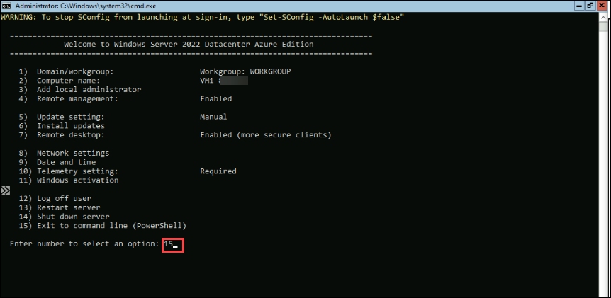

1. Ping the private IP address of the Azure firewall (**FW1**).

    ```powershell
    ping 10.1.1.4
    ```

1. On **VM1-<inject key="Deployment ID" enableCopy="false" />**, in the command prompt window ping the private IP address of **VM2-<inject key="Deployment ID" enableCopy="false" />**.

    ```powershell
    ping 10.3.1.4
    ```

    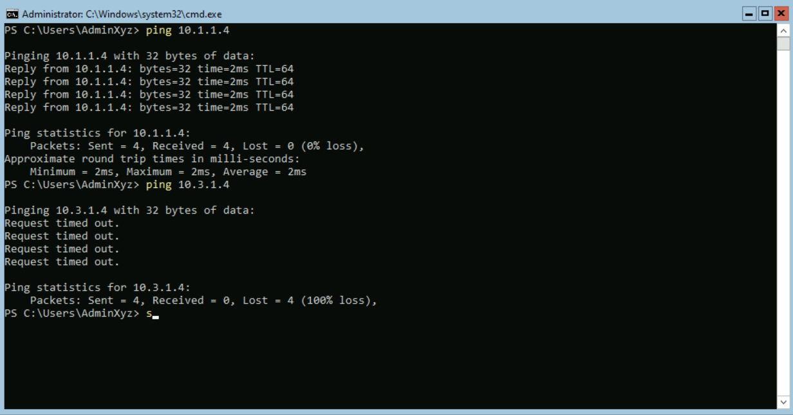

    The firewall is reachable from **VM1-<inject key="Deployment ID" enableCopy="false" />** and **VM2-<inject key="Deployment ID" enableCopy="false" />** isn't.

1. Now, switch back to Azure portal and on the breadcrumb trail select **virtual machines**, repeat the above steps to select the **VM2-<inject key="Deployment ID" enableCopy="false" />** and connect with Bastion.

    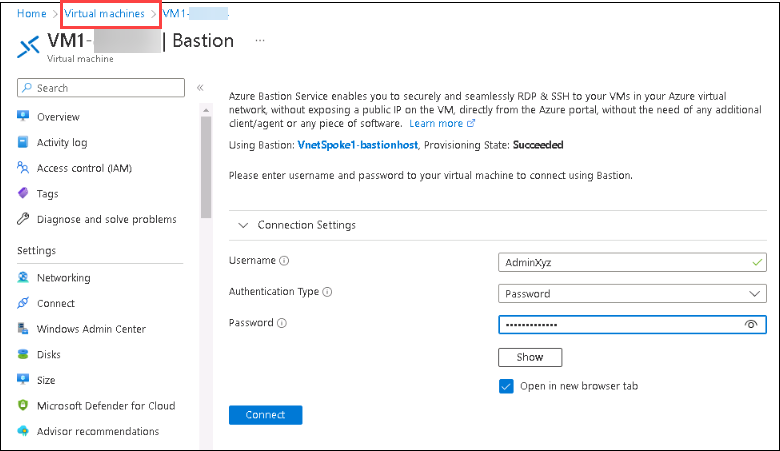

1. Use these Windows credentials:

    - User name: **AdminXyz**
    
    - Password: **Azur$Pa55w0rd**

1. After you've connected to the machine, in the SConfig menu, enter option **15**.

1. Ping the private IP address of the Azure firewall (**FW1**).

    ```powershell
    ping 10.1.1.4
    ```

1. Ping the private IP address of **VM1-<inject key="Deployment ID" enableCopy="false" />**.

    ```powershell
    ping 10.2.1.4
    ```

    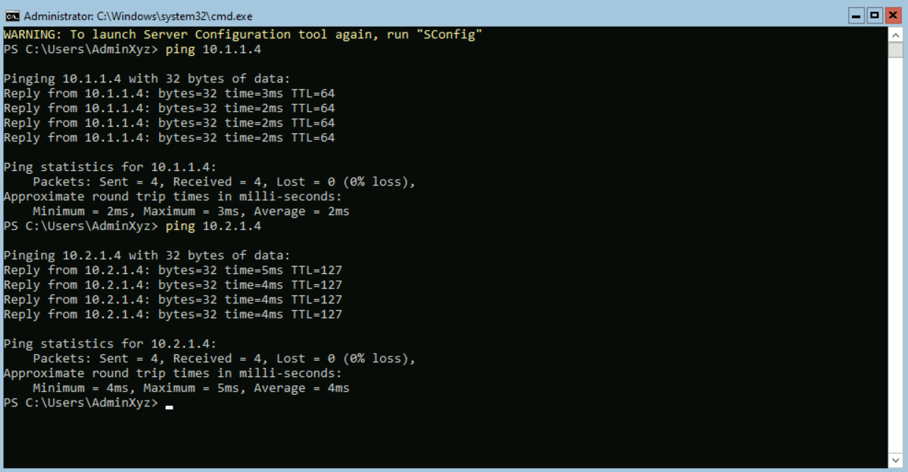

    On VM2-<inject key="Deployment ID" enableCopy="false" /> both the firewall and VM1-<inject key="Deployment ID" enableCopy="false" /> are reachable.

### Task 3: Troubleshoot the problem

1. To understand what is causing the problem, try the following troubleshooting steps:

1. Examine ipconfig /all on both **VM1-<inject key="Deployment ID" enableCopy="false" />** and **VM2-<inject key="Deployment ID" enableCopy="false" />**.

1. Examine the Network Security Groups, and routing tables.

1. Examine the firewall and the firewall rules.

1. Examine the peering connection properties.

    The diagram shows the effective routes on VM1-nic.

    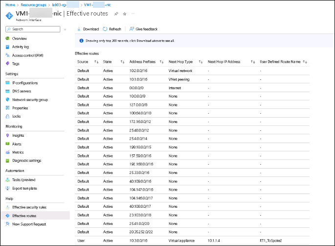

## Task 4: Resolve the connection issue

When you examined the peering connections, you find that the peering settings are different.

| **VNet**| **Peering name**| **Traffic forwarded from remote virtual network**|
| :--- | :--- | :--- |
| VnetHub| Hub-Spoke1| Allow (default)|
| VnetHub| Hub-Spoke2| Block traffic that originates from outside this virtual network|
| VnetSpoke1| Spoke1-Hub| Allow (default)|
| VnetSpoke2| Spoke2-Hub| Block traffic that originates from outside this virtual network|

1. Select VnetHub and click on **Peerings** under settings tab


The settings on **Hub-Spoke2** are incorrect.


To fix the problem, you must change the setting on both sides of the peering between VnetHub and VnetSpoke2.

- Hub-Spoke2

- Spoke2-Hub

The **Traffic forwarded from remote virtual network** must be set to **Allow**. There will be a short delay before the new settings take effect. If the ping fails at first, try again.

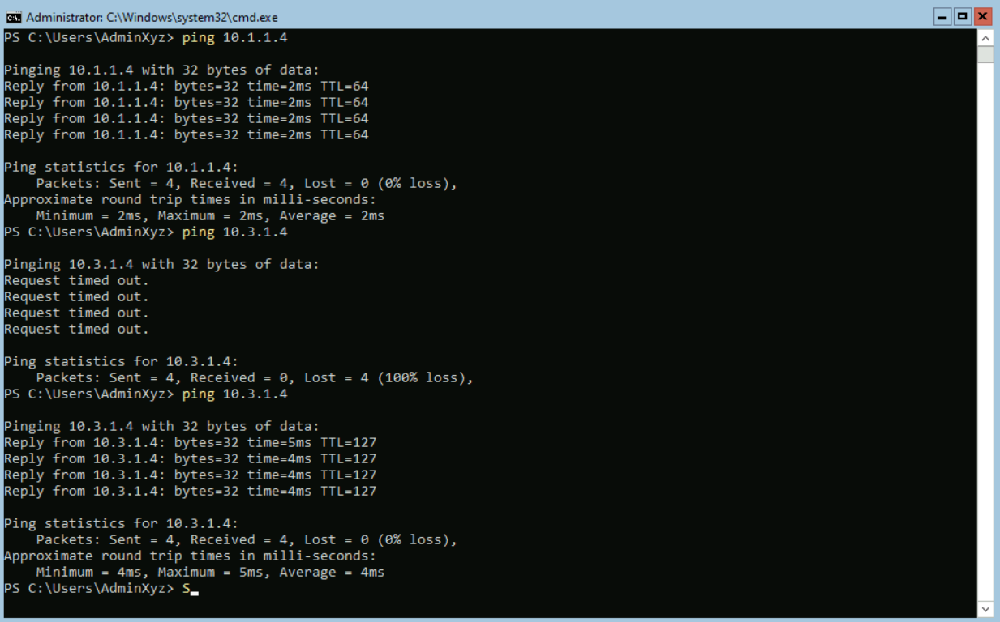

It's now possible to ping VM2-<inject key="Deployment ID" enableCopy="false" /> from VM1-<inject key="Deployment ID" enableCopy="false" />.
