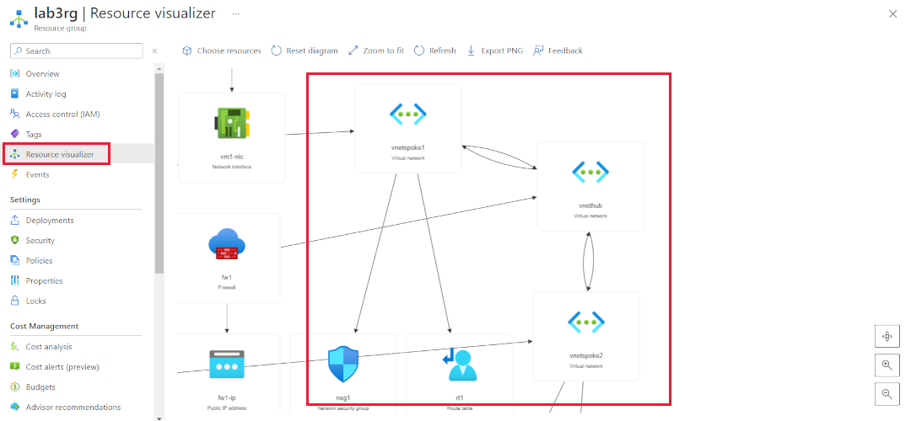

---
lab:
    title: 'Lab 3 - Troubleshoot cloud and hybrid connectivity'
    module: 'Troubleshoot cloud and hybrid connectivity in Microsoft Azure'
---

An Azure subscription is provided for this lab, see the credentials above. If you're interested in completing this lab using your own Azure subscription, sign up for a free trial at <https://azure.microsoft.com/free/>.

# Troubleshoot cloud and hybrid connectivity in Microsoft Azure

**Estimated Time: 15 minutes**

You've configured your network as shown in the diagram below. You want VM1 and VM2 to communicate via the VnetHub. Users are complaining that VM1 cannot communicate with VM2. You need to investigate to diagnose the problem and then fix it.

There are three Azure virtual networks (VNets) in a hub and spoke topology.


## Verify the network topology

1. Sign in to the [Azure portal](https://portal.azure.com) using the Azure credentials above or if you'd like your own Azure subscription.

1. Select the portal menu on the top left, select **Resource groups**.

1. Select **lab3rg**.

    

1. Select **Resource visualizer**.

1. Check the private IP addresses of the firewall (**FW1**) and virtual machines (**VM1** and **VM2**). These are allocated automatically.

### Check OSI level 3 connectivity

1. Connect to each virtual machine (**VM1** and **VM2**) using Bastion.

1. Use these Windows credentials:

    - User name: **AdminXyz**
    
    - Password: **Azur$Pa55w0rd**

1. After you've connected to the machine, in the SConfig menu, enter option **15**.

1. Ping the private IP address of the Azure firewall (**FW1**).

    ```powershell
    ping 10.1.1.4
    ```

1. On **VM1**, in the command prompt window ping the private IP address of **VM2**.

    ```powershell
    ping 10.3.1.4
    ```

    

    The firewall is reachable from **VM1** and **VM2** isn't.

1. On **VM2**, connect with Bastion.

1. Use these Windows credentials:

    - User name: **AdminXyz**
    
    - Password: **Azur$Pa55w0rd**

1. After you've connected to the machine, in the SConfig menu, enter option **15**.

1. Ping the private IP address of the Azure firewall (**FW1**).

    ```powershell
    ping 10.1.1.4
    ```

1. Ping the private IP address of **VM1**.

    ```powershell
    ping 10.2.1.4
    ```

    

    On VM2 both the firewall and VM1 are reachable.

### Troubleshoot the problem

1. To understand what is causing the problem, try the following troubleshooting steps:

1. Examine ipconfig /all on both **VM1** and **VM2**.

1. Examine the Network Security Groups, and routing tables.

1. Examine the firewall and the firewall rules.

1. Examine the peering connection properties.

    The diagram shows the effective routes on VM1-nic.

    

## Resolve the connection issue

When you examined the peering connections, you find that the peering settings are different.

| **VNet**| **Peering name**| **Traffic forwarded from remote virtual network**|
| :--- | :--- | :--- |
| VnetHub| Hub-Spoke1| Allow (default)|
| VnetHub| Hub-Spoke2| Block traffic that originates from outside this virtual network|
| VnetSpoke1| Spoke1-Hub| Allow (default)|
| VnetSpoke2| Spoke2-Hub| Block traffic that originates from outside this virtual network|


The settings on **Hub-Spoke2** are incorrect.


To fix the problem, you must change the setting on both sides of the peering between VnetHub and VnetSpoke2.

- Hub-Spoke2

- Spoke2-Hub

The **Traffic forwarded from remote virtual network** must be set to **Allow**. There will be a short delay before the new settings take effect. If the ping fails at first, try again.


It's now possible to ping VM2 from VM1.