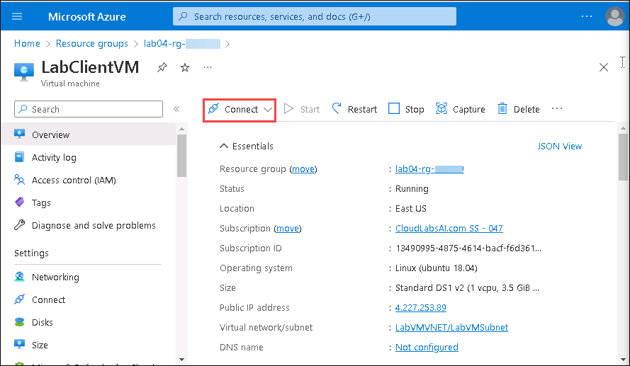
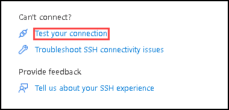
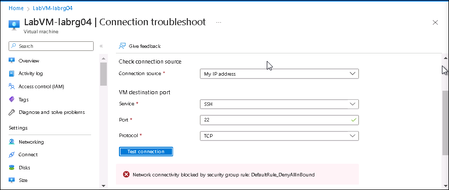

# Troubleshoot virtual machine connections

**Estimated Time: 20 minutes**

In this lab you'll troubleshoot connection issues to a virtual machines running in Azure.

## Task-1: Check a virtual machines settings

You need to find the causes of connectivity problems to an Azure virtual machine using SSH.
   
1. From the Azure portal, select **Resource groups** under **Navigate**.

    

1. In the resource groups, select **lab04-rg-<inject key="DeploymentID" enableCopy="false"/>**.

1. Now, select the virtual machine named **LabClientVM**.

1. On the top row of the **LabClientVM Overview** page, select **Connect**, then select **SSH**.

   

1. Scroll to the bottom of the pane and select **Test your connection**. This provides a troubleshooter to test connections to your resources.

   

1. Click on **Test Connection**

1. Note the connection test succeeds.

1. At the top of the screen, select **lab04-rg-<inject key="DeploymentID" enableCopy="false"/>**.

1. Select **LabVM-labrg04**.

1. On the top row of the **Overview** pane, select **Connect**, then select **SSH**.

1. Scroll to the bottom of the pane and select **Test your connection**.

1. Click on **Test Connection**

    

    The connection test points to an issue connecting based on a security group error.

1. Select **Networking**.

1. In the **Network security group** section, notice that there is not a rule at the top of the priority list that will allow TCP connections on port 22.

    

1. Note: except for load balancers and virtual networks, the highest priority rule will deny all inbound traffic. This will cause connectivity problems.

## Task-2: Resolve the connection issues

Follow these steps in the Azure portal:

1. Select **Home** to return to the Azure portal home screen.

1. Click on Resource groups and select **lab04-rg-<inject key="DeploymentID" enableCopy="false"/>**.

1. Select **LabVM-labrg04**.

1. In Settings, **select Networking**.

   

1. Select **Add inbound port rule**.

   

1. On the Add inbound security rule tab, type or select the following values and leave remaining as default:

   - **Destination port ranges: 22**
  
   - **Protocol: TCP**

   - **Action: Allow**

   - **Priority: 100**

   - **Name: SSH_port_22**

    

1. Select **Add**.

1. Wait until the security rule has been deployed.

1. On the left, under **Settings**, select **Connect**, then select **SSH**.

1. Scroll down and select **Test your connection**.

   

1. Select **Test Connection**.

1. Notice that connectivity is now allowed and you've resolved the connectivity issue.

   

