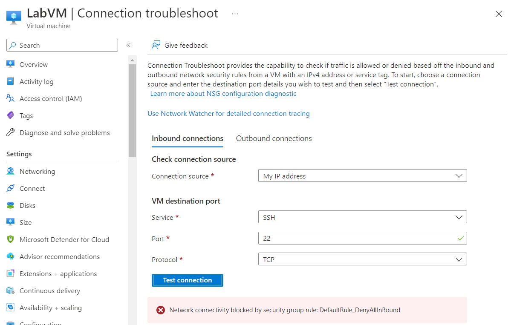

---
lab:
    title: 'Lab 4 - Troubleshoot virtual machine connections'
    module: 'Troubleshoot platform-as-a-service issues in Microsoft Azure'
---

An Azure subscription is provided for this lab, see the credentials above. If you're interested in completing this lab using your own Azure subscription, sign up for a free trial at <https://azure.microsoft.com/free/>.

# Troubleshoot virtual machine connections

**Estimated Time: 10 minutes**

In this lab you'll troubleshoot connection issues to a virtual machines running in Azure.

## Check a virtual machines settings

You need to find the causes of connectivity problems to an Azure virtual machine using SSH.

1. Sign in to the [Azure portal](https://portal.azure.com) using the credentials above, or if you'd like your own Azure subscription.

1. In the resource menu, select **All Resources**.

1. Select **LabClientVM**.

   

1. On the top row of the **LabClientVM Overview** page, select **Connect**, then select **SSH**.

   

1. Scroll to the bottom of the pane and select **Test your connection**. This provides a troubleshooter to test connections to your resources.

1. Note the connection test succeeds.

1. At the top of the screen, select **All resources**.

1. Select **LabVM**.

1. On the top row of the **Overview** pane, select **Connect**, then select **SSH**.

1. Scroll to the bottom of the pane and select **Test your connection**.

    

    The connection test points to an issue connecting based on a security group error.

1. Select **Networking**.

1. In the **Network security group** section, notice that there is not a rule at the top of the priority list that will allow TCP connections on port 22.

    

1. Note except for load balancers and virtual networks, the highest priority rule will deny all inbound traffic. This will cause connectivity problems.

## Resolve the connection issues

Follow these steps in the Azure portal:

1. Select **Home** to return to the Azure portal home screen.

1. In the resource menu, select All **Resources**.

1. Select **LabVM**.

1. In Settings, **select Networking**.

   

1. Select **Add inbound port rule**.

   

1. On the Add inbound security rule tab, type or select the following values:

   - **Destination port ranges: 22**

   - **Action: Allow**

   - **Priority: 100**

   - **Name: SSH_port_22**

1. Select **Add**.

1. Wait until the security rule has been deployed.

1. On the left, under **Settings**, select **Connect*, then select **SSH**.

1. Scroll down and select **Test your connection**.

   

1. Select **Test connection**.

1. Notice that connectivity is now allowed and you've resolved the connectivity issue.

   

