# Troubleshoot virtual machine connections

**Estimated Time: 30 minutes**

You work as a support engineer supporting Azure infrastructure. You've been contacted by your web team about an issue with the website not responding. The web team have a pool of webservers behind a load balancer and public IP address.

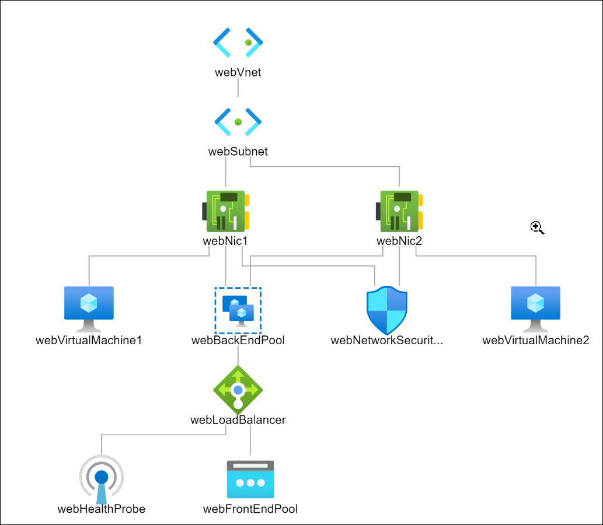

In this lab, you'll use what you've learned to go through steps to troubleshoot the connection issues to the virtual machines.

## Task-1: Verify that the website can't be reached

1. From the portal open the **Cloud shell (1)**, use this Azure CLI command in the Cloud Shell to get the public IP address of the scale set.

2. Select **Bash** and if there is any pop-up to create storage, follow the below steps.

   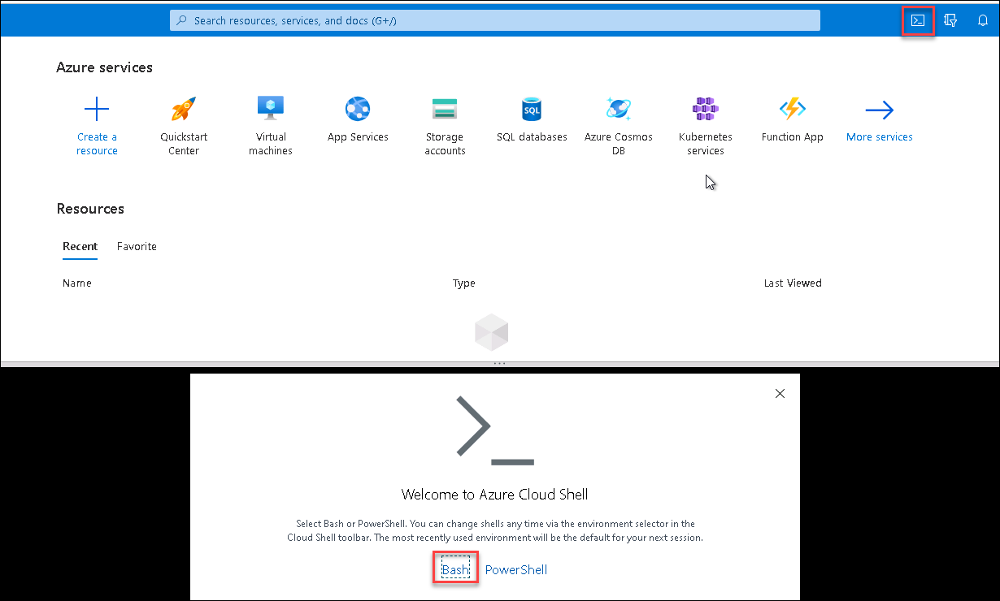

3. Click on **Show advanced settings** and then provide the following details and click **Create Storage**

    

   * Resource group : Select **Use existing** -> **lab05-rg-<inject key="DeploymentID" enableCopy="false"/>**
   * Storage account : Select **Create new** and Enter **cloudstore<inject key="DeploymentID" enableCopy="false"/>**
   * File Share: Select **Create new** and Enter **blob**


4. In the cloud shell run this command:

    ```
    az network public-ip show \
    --resource-group lab05-rg-$DID \
    --name webPublicIP \
    --query '[ipAddress]' \
    --output tsv
    ```
    >**Note**: Replace $DID with the Deployment Id from your Environment details page.

5. Copy the IP address, in a new tab in your browser, try to navigate to it.

    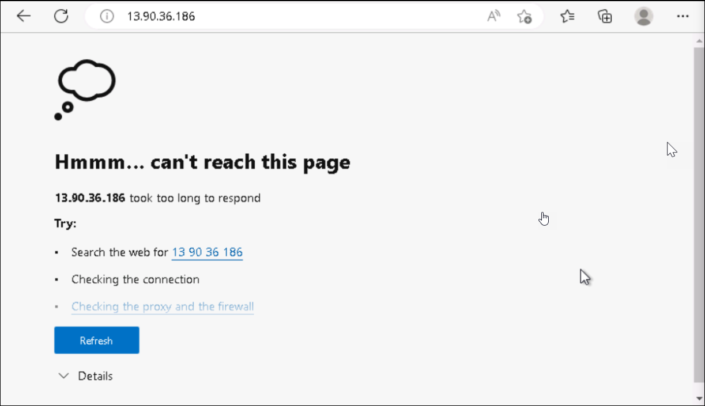

    >**Note**: You're IP address will be different to the one in the above screenshot.

### Task-2: Check that Network Security Groups are configured correctly

1. In the Azure portal search for **Network security groups**.

   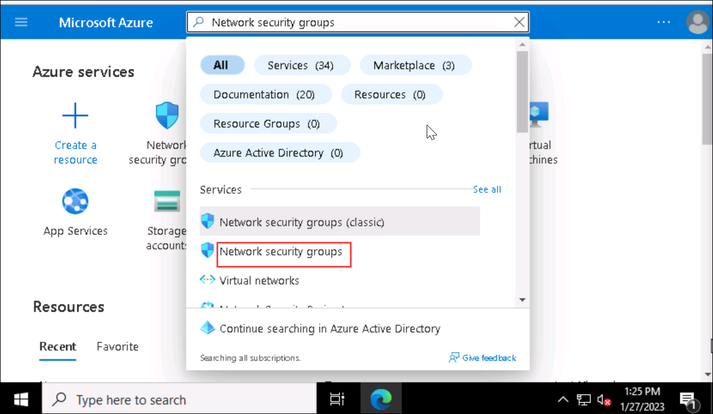

1. Under **Services**, select **Network Security Groups**.

    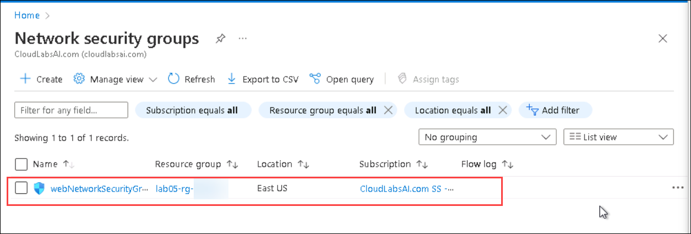

1. Select **webNetworkSecurityGroup**.

1. Check that internet traffic over port **80** is allowed by the Network Security Group.

    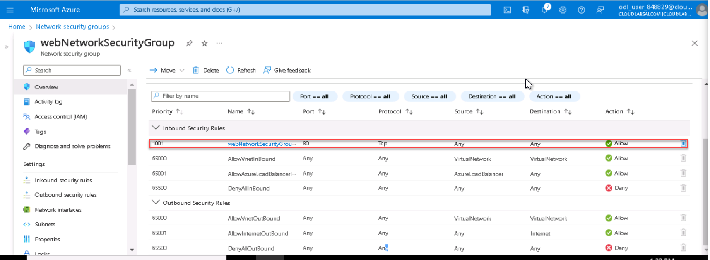

### Task-3: Check the network settings for the virtual machines

1. Go to Resource Groups and select **lab05-rg-<inject key="DeploymentID" enableCopy="false"/>**

1. Select **WebVM1-labrg05-<inject key="DeploymentID" enableCopy="false"/>**

   

1. On the left, under **Settings**, select **Networking**.

1. Note that port 80 is allowed.

   

1. Repeat these steps for **WebVM2-labrg05-<inject key="DeploymentID" enableCopy="false"/>** virtual machine.

### Task-4: Check the load balancer

1. In the Azure portal, search for **Load balancers**, then under **Services**, select **Load balancers**.

    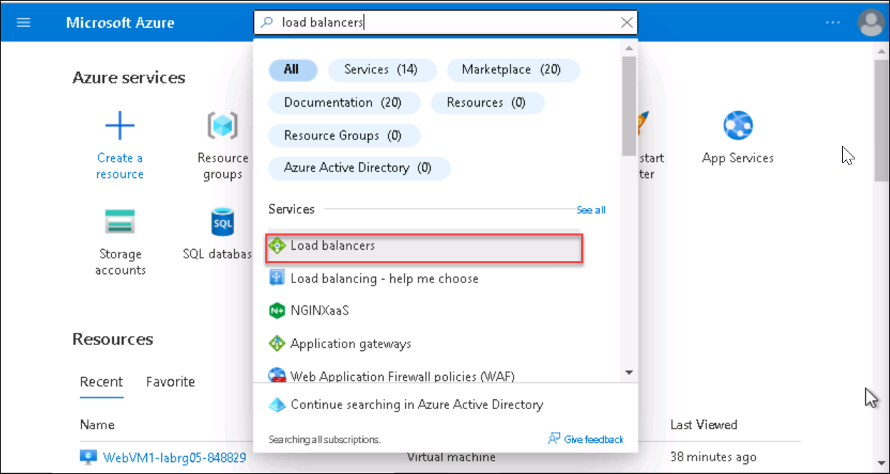

1. Select the **webLoadBalancer**.

1. On the left, under **Settings**, select **Frontend IP configuration**.

   

1. Check that there is a frontend IP address, and that this is the IP you tested at the beginning of this exercise.

1. On the left, under **Settings**, select **Load balancing rules**.

   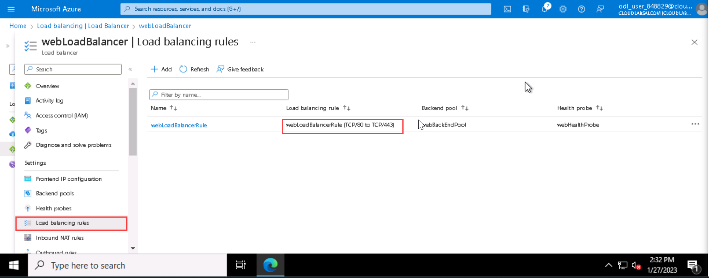

   >**Note**:
   > There is a rule for port **80** and port **443**

### Task-5: Use the Diagnose and solve problems troubleshooter

1. On the left, select **Diagnose and solve problems**.

1. Select the **No connectivity to the backend pool** troubleshooter.

   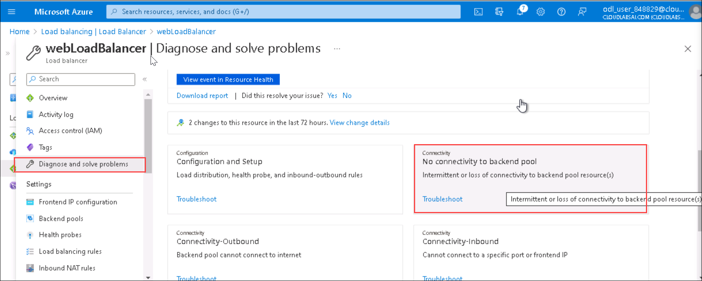

1. In the **Tell us more about the problem you are experiencing** drop-down box, select **Intermittent connectivity**.

1. Scroll down and read the insight found.

    
    
    >**Note**: Wait for 3-5 min to display the output as shown in above screenshot. 

    The insight points to the fact that the backend instances in the pool aren't listening for port **443**. The website instances should be listening to port **80**. This insight points to a problem in the load balancer rule.

## Resolve the connection issue

After investigating the connection issues to your website, you've found an issue with the load balancer rule user by the virtual machine scale set. You'll now resolve the issue and check that the website can be accessed.

### Task-6: Validate load balancer rules

1. In the Azure portal, search for **load balancers**, and then under **Services**, select **Load balancers**.

   

1. Select the **webLoadBalancer** load balancer.

1. Under **Settings**, select **Load balancing rules**.

   

1. From the list of rules, select **webLoadBalancerRule**.

   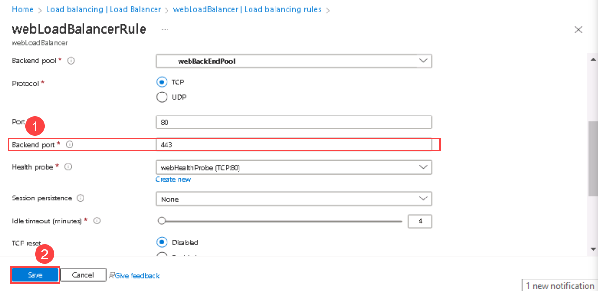

1. To resolve the backend issue, change the **Backend port** from **443** to **80**, and then select **Save**.

    >**Note**:
    > The front and backend in this environment need to be the same to get a response from the webserver to http requests.

1. Wait until the rule has been deployed successfully.

    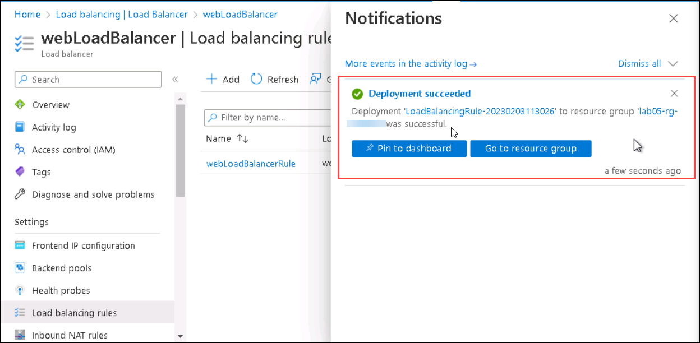

### Verify that the website can now be reached

1. Refresh the tab you opened to test the public IP address.

    >**Note**:
    > If you have closed the previous browser tab, run this command to get the public IP address.
    >
    > ```
    > az network public-ip show \
    > --resource-group lab05-rg-$DID \
    > --name webPublicIP \
    > --query '[ipAddress]' \
    > --output tsv
    > ```
    >**Note**:Replace $DID Value from the DeploymentID from the Environment Details page.

    If the website is online, you'll see a page with a **Hello World** message from the backend instance.

    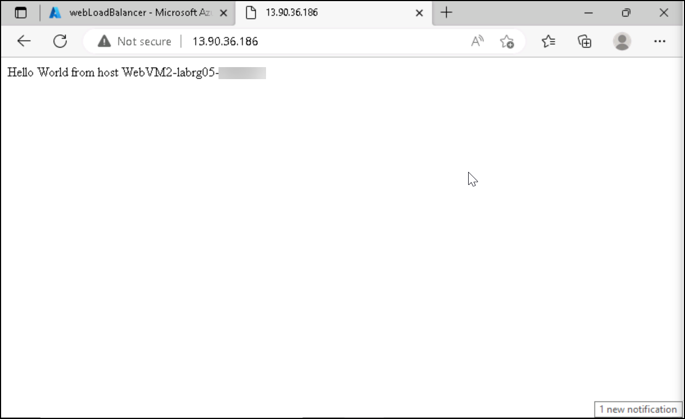


