# Module 06: Troubleshoot routing, traffic control and load balancing issues

## Estimated timing: 10 minutes

You work as a support engineer supporting Azure infrastructure. You've been contacted by your web team about an issue with website performance. The web team has a pool of webservers behind a load balancer and public IP address.

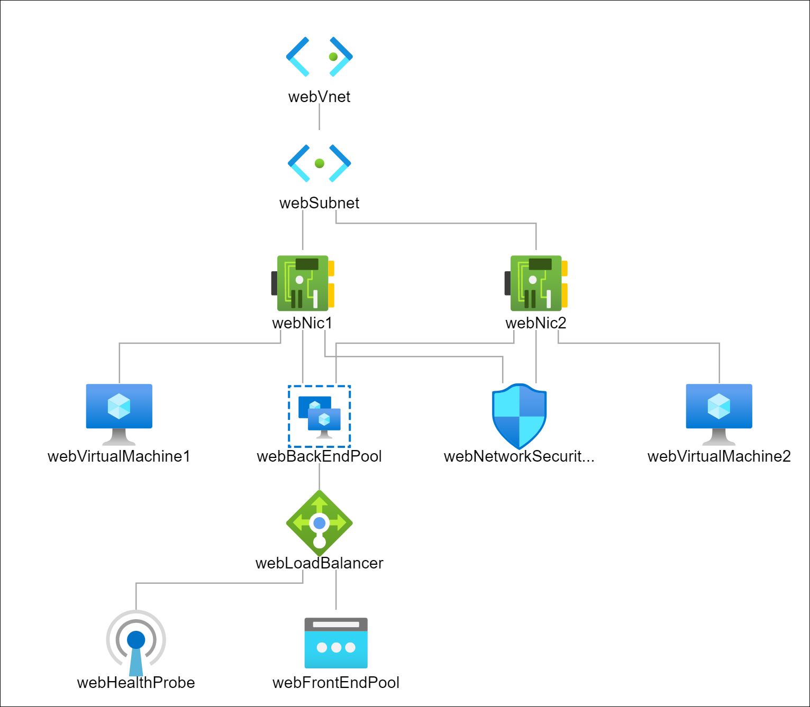

The web team thinks that the internet traffic isn't being distributed equally between all the webservers.

In this lab, you'll use what you've learned to go through steps to troubleshoot the performance issues with your organization's website.

## Task 1: Check that the issue still exists

1. Use this Azure CLI command in the Cloud Shell to get the public IP address of the scale set.

    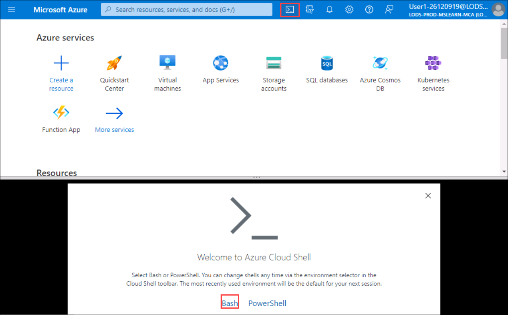

1. Select **Bash**

1. Click **Show advanced settings** and enter the details as shown below:
 
    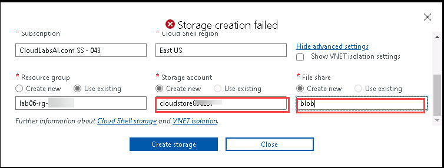

   * Resource group : Select **Use existing** -> **lab06-rg-<inject key="DeploymentID" enableCopy="false"/>**
   * Storage account : Select **Create new** and Enter **cloudstore<inject key="DeploymentID" enableCopy="false"/>**
   * File Share: Select **Create new** and Enter **blob**

> **Note :** Please wait until the storage account is created and proceed with step4.

4. In the cloud shell run this command:
   
    ```
    az network public-ip show \
    --resource-group lab06-rg-DID \
    --name webPublicIP \
    --query '[ipAddress]' \
    --output tsv
    ```
    > **Note** In the above snippet, replace **DID** with <inject key="Deployment ID" enableCopy="false" />

5. Copy the IP address, in a new tab in your browser, try to navigate to it.

     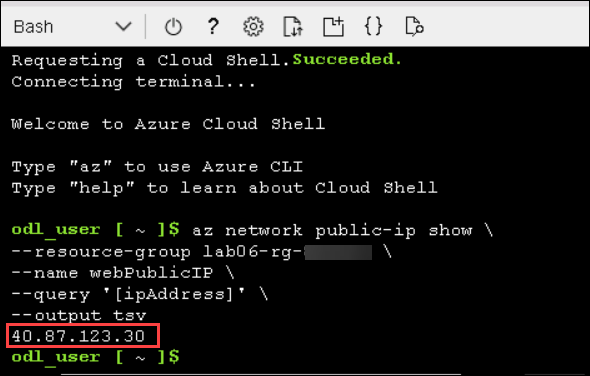
    > **Note**
    > Your IP address will be different to the one shown in the screenshot.

6. Hit refresh in your browser for few times and notice that you are getting a response from the same webserver every single time.

    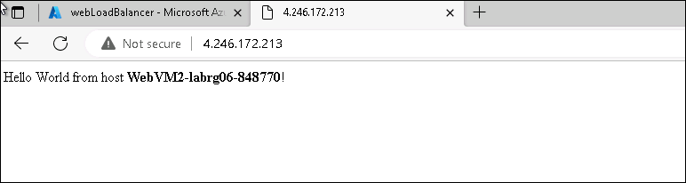

7. Leave this tab open to check you resolve the issue in the next exercise.

## Task 2: Check all the virtual machines are responding on port 80

1. Navigate to the Azure Portal in a new tab.

1. Select **Virtual machines**.

    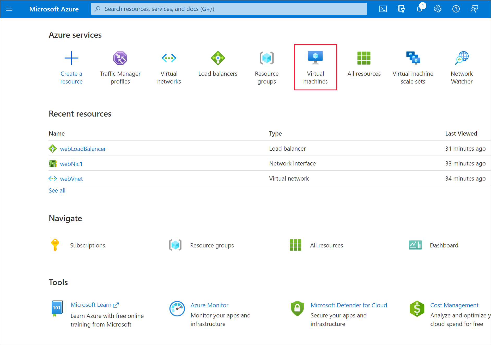

1. Select **WebVM1-labrg06-<inject key="Deployment ID" enableCopy="false" />**.

1. Under **Settings**, select **Networking**.

    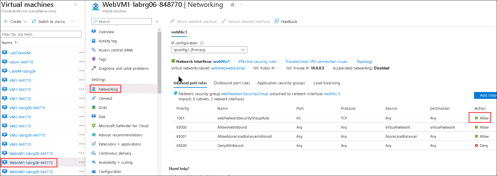
  
1. Check that inbound traffic is allowed on port **80**.

1. Repeat the above for **WebVM2-labrg06-<inject key="Deployment ID" enableCopy="false" />**.

The current settings appear to be correct.

## Task 3: Check the Load Balancer settings

1. Select **Home**.

1. Search for **Load balancers**.

    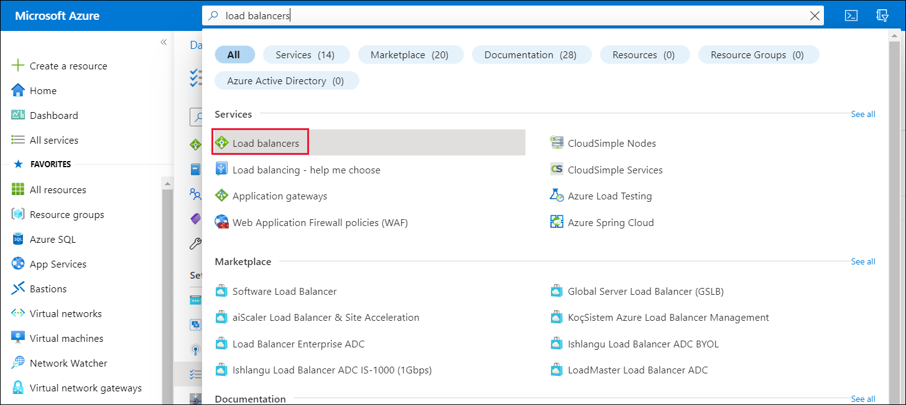

1. Under **Services**, select **Load balancers**.

    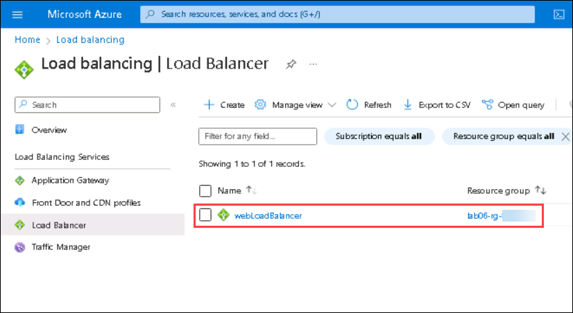

1. Select **webLoadBalancer**.

1. Under **Settings**, Select the **Frontend IP configuration**.

    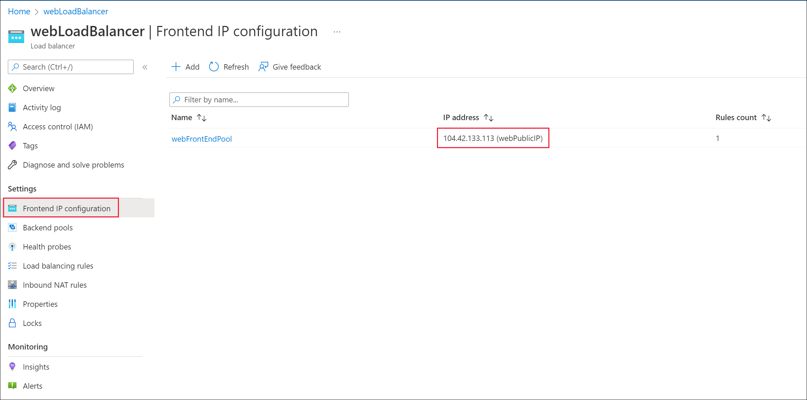

    > **Note**
    > There is a correctly configured frontend IP address. Check that it matches the IP address you have in your other tab.

1. Under **Settings**, select **Backend pools**.

    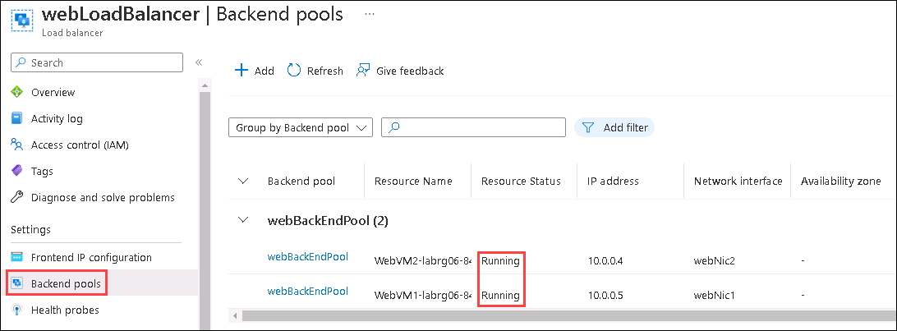

    > **Note**
    > The virtual machines are both running.

1. Under **Settings**, select **Load balancing rules**, then select **webLoadBalancerRule**.

    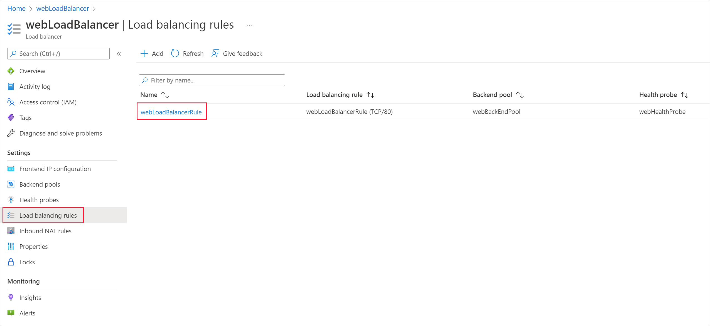

1. Check all the settings for the load balancer rule and leave the rest at default.

    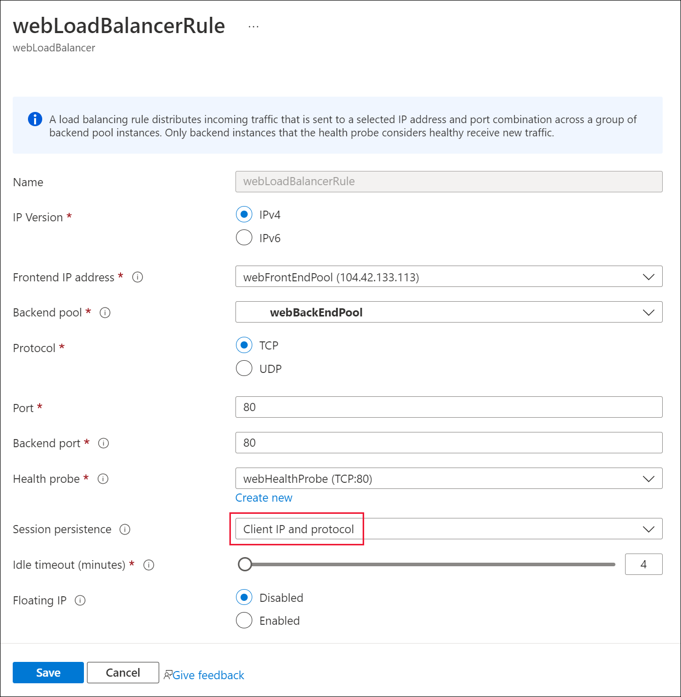

You think you have identified the issue. At the moment once a user visits the website they are routed to one virtual machine. This will persist because of the **Session persistence** setting.

## Task 4: Resolve load balancer issue

1. To resolve the backend issue, change the **Session persistence** from **Client IP and protocol** to **None**, and then select **Save**.

    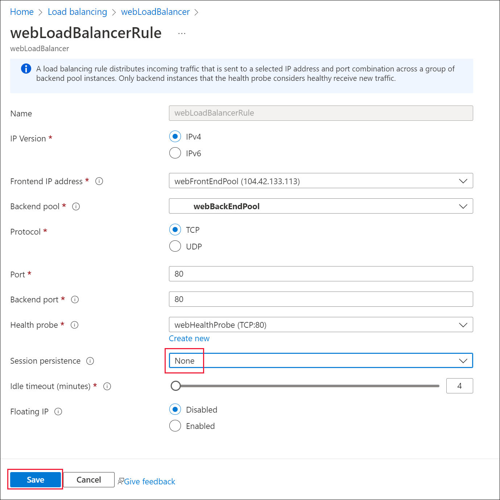

    > **Note**
    > By setting **Session persistence** to **None**, successive request from clients can be handled by different virtual machines.

1. Wait until the rule has been deployed successfully.

## Task 5: Test that the issue has been resolved

Switch back to the tab where you pasted the public IP address. If you have closed the tab select the load balancer rule and the public IP address is listed there.

1. Refresh the browser 20 or 30 times, you should see the message switch between **WebVM1-labrg06-<inject key="Deployment ID" enableCopy="false" />** and **WebVM2-labrg06-<inject key="Deployment ID" enableCopy="false" />**.
1. The traffic is now being shared correctly between all the machines in the backend pool.

    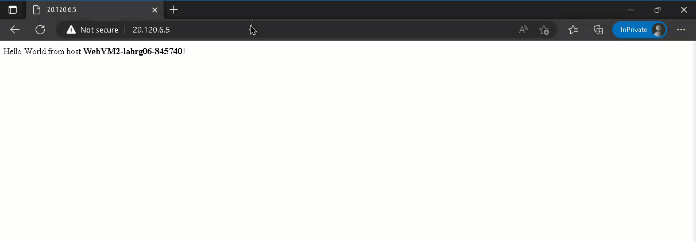
