# Troubleshoot routing, traffic control and load balancing issues

**Estimated Time: 10 minutes**

You've been contacted by one of the teams you support. The team is having problems connecting to their VM using the Azure Bastion service.

In this lab, you'll see how to troubleshoot the Azure Bastion Service.

## Task 1: Check that the issue still exists

1. If you are not logged in already, click on Azure portal shortcut that is available on the desktop and log in with below Azure credentials or skip to the next step.\
    **Azure Username/Email:** <inject key="AzureAdUserEmail"></inject> \
    **Azure Password:** <inject key="AzureAdUserPassword"></inject>
    
1. Select the top left portal menu, select **Virtual machines**, then select **labvm-<inject key="DeploymentID" enableCopy="false"/>**.

1. On the Overview pane, select **Connect**, then select **Bastion**.

1. In **Username**, enter **<inject key="VM Admin Username" enableCopy="true"/>**.

1. In **Password**, enter **<inject key="VM Admin Password" enableCopy="true"/>**.

1. Select **Connect**.

>**Note** It takes time for the new tab to open, and when it does there's no response.

## Task 2: Check that Bastion has been deployed

1. In the Azure portal, in the search box, type **Bastions**.

   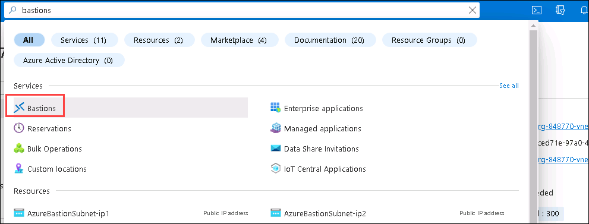

1. From the results, under **Services**, click **Bastions**.

1. You should see the Bastion service listed.

   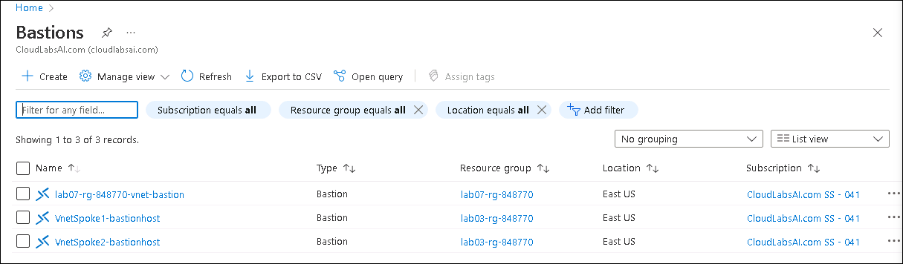

## Task 3: Check if AzureBastionSubnet is using a Network Security Group correctly

1. In the Azure portal, in the search box, type **Bastions**.

1. From the results, under **Services**, click **Bastions**.

1. Select the **lab07-rg-<inject key="DeploymentID" enableCopy="false"/>-vnet-bastion**.

   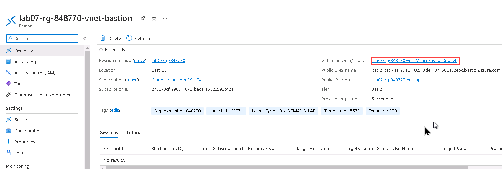

1. In the top right, click the **Virtual network/subnet** link.

   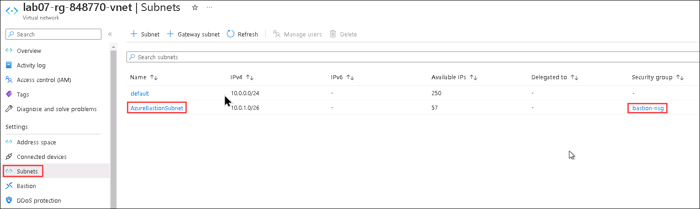

1. Under **Settings**, click **Subnets**, and then click **bastion-nsg**.

If Azure Bastion has a **Network security group** associated with the subnet, you need to check that it has all the inbound and outbound rules created. See the official Microsoft documentation, https://learn.microsoft.com/azure/bastion/bastion-nsg. Are there any rules missing?

## Task 4: Check if there's a private DNS zone

1. In the Azure portal, in the search box, type **private dns**.

   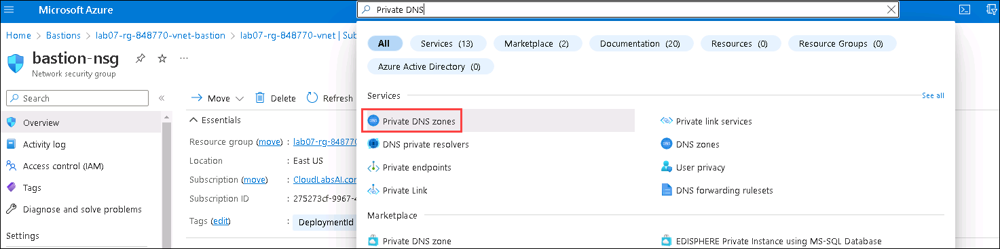

1. From the results, under **Services**, click **Private DNS zones**.

   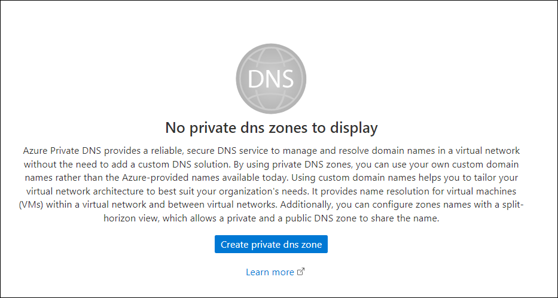

1. You shouldn't see any private DNS zones.

1. If there are any zones listed, check that they don't end in **azure.com** or **core.windows.net**.

   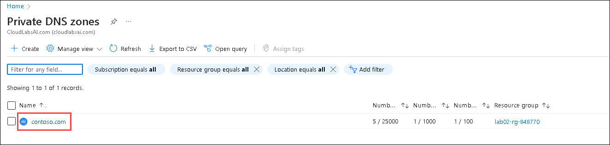

## Task 5: Run the Connection Troubleshoot tool to check for issues

1. In the Azure portal, in the search box, type **Bastions**.

1. From the results, under **Services**, click **Bastions**.

1. Select the Bastion you are troubleshooting.

1. Under **Monitoring**, click **Connection Troubleshoot**.

1. Under **Resource group**, select **lab07-rg-<inject key="DeploymentID" enableCopy="false"/>**

1. Under **Virtual machine**, select the only existing Virtual Machine.

1. Select your **Preferred IP Version**.

1. In the **Destination port**, we use **RDP**, enter **3389** for this lab.

1. Click **Check**.

    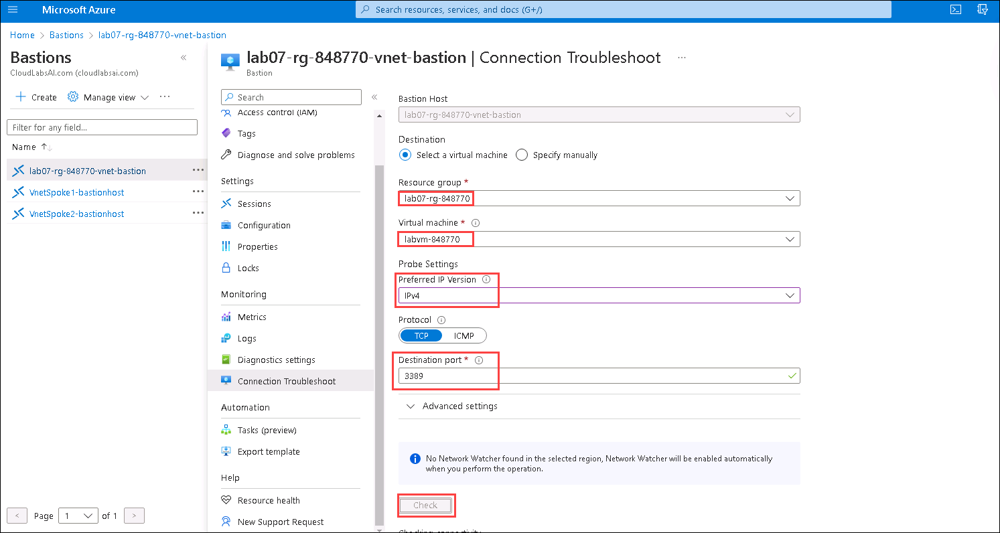

1. The connection troubleshooter will show that the VM is reachable, even though it isn't.

    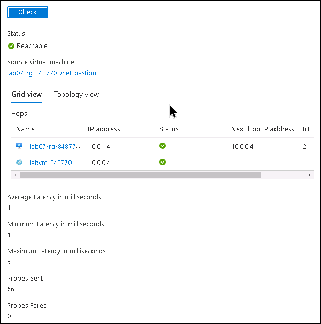

## Task 6: Resolve the bastion connection issue

After reviewing the bastion-nsg network security group you notice that there is a missing rule.

1. In the Azure portal, in the search box, type **Network security groups**.
1. Select **bastion-nsg** of Resource Group **lab07-rg-<inject key="DeploymentID" enableCopy="false"/>**.
1. Select **Inbound security rules**.
1. Select **+ Add**.
1. In the fly out, enter these details:

    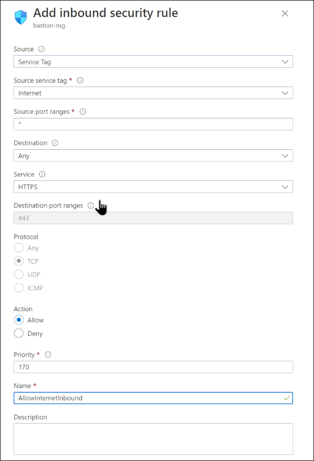

    - Source: **Service Tag**
    - Source service tag: **Internet**
    - Service: **HTTPS**
    - Name: **AllowInternetInbound**

1. Select **Add**.

## Task 7: Test the issue is resolved

1. Select the top left portal menu, select **Virtual machines**, then select **labvm-<inject key="DeploymentID" enableCopy="false">**.

1. On the Overview pane, select **Connect**, then select **Bastion**.

1. In **Username**, enter **<inject key="VM Admin Username" enableCopy="true"/>**.

1. In **Password**, enter **<inject key="VM Admin Password" enableCopy="true"/>**.

1. Select **Connect**.

    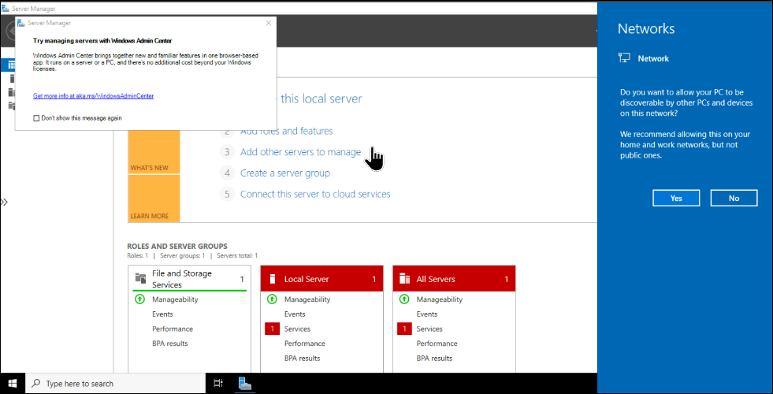

    You should see a new tab open and connect to your VM.
